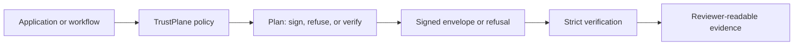

# 01. Product Overview

TrustPlane PQ Bridge is policy-governed signing infrastructure for enterprise applications.

The first wedge is post-quantum signing migration:

## The Problem

Post-quantum migration is not a single switch.

1. Some systems still need classical compatibility.
2. Some boundaries should require classical plus PQ signatures.
3. Some future-facing workflows should require PQ-only behaviour.
4. Security reviewers need evidence of what happened and why.

Without a policy layer, migration logic becomes scattered across services, deployment scripts, and reviewer notes.

## The PQ Bridge Approach

Developers choose policy. TrustPlane decides the allowed cryptographic behaviour.

Supported policies:

1. `legacy_required`
2. `hybrid_preferred`
3. `hybrid_required`
4. `pq_required`

Every outcome should answer:

1. What policy was applied?
2. What capabilities were available?
3. Which algorithms were used?
4. Did fallback happen?
5. Why did signing, verification, or refusal occur?

## Current Algorithm Coverage

Classical signing support:

1. `ECDSA_P256`
2. `ECDSA_P384`
3. `ED25519`
4. `RSA_PSS_2048_SHA256`
5. `RSA_PSS_3072_SHA384`

Post-quantum signing support in PQ-capable runtimes:

1. `oqs-ml-dsa-44`
2. `oqs-ml-dsa-65`
3. `oqs-ml-dsa-87`
4. `oqs-slh-dsa-sha2-128s`
5. `oqs-slh-dsa-sha2-128f`
6. `oqs-slh-dsa-sha2-192s`
7. `oqs-slh-dsa-sha2-192f`
8. `oqs-slh-dsa-sha2-256s`
9. `oqs-slh-dsa-sha2-256f`
10. `oqs-slh-dsa-shake-128s`
11. `oqs-slh-dsa-shake-128f`
12. `oqs-slh-dsa-shake-192s`
13. `oqs-slh-dsa-shake-192f`
14. `oqs-slh-dsa-shake-256s`
15. `oqs-slh-dsa-shake-256f`

SLH-DSA support is limited to pure signing variants in this release. `ML-KEM` is a key-encapsulation primitive and is outside the current signing-focused contract.

## What This Is

1. Policy-governed signing infrastructure for enterprise applications.
2. A deterministic signing and verification control layer.
3. A source-free evaluator path for design partners.
4. A practical proof point for post-quantum signing readiness.

## What This Is Not

1. Not a hosted SaaS control plane today.
2. Not KMS, HSM, key custody, or certificate lifecycle management.
3. Not IAM, PKI, CI/CD, or a generic policy-management dashboard.
4. Not a generic AI governance dashboard.
5. Not a public source release.

## Why It Matters

The value is not “another signing library.”

The value is being able to prove:

> This specific action was signed or refused under the correct policy, with the correct capabilities, at the correct point of execution, and verification evidence exists.

Performance snapshot:

1. See [08. Performance Snapshot](08-performance-snapshot.md) for local evaluator benchmark results.
2. The default ML-DSA path remained sub-millisecond in the latest standard benchmark.
3. SLH-DSA is supported, but its signing cost means it should be selected deliberately rather than treated as the default online signing path.
