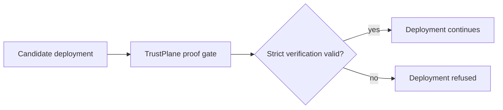

# 04. GitHub Actions Proof Gate

The first workflow-gate story is:

> No valid TrustPlane proof, no deployment.

Use this pattern when a release, promotion, deployment, or other high-assurance workflow should proceed only if a TrustPlane envelope verifies under the expected policy.

## Expected Workflow States

### Valid Proof Passes

1. The workflow receives a payload and TrustPlane envelope.
2. The proof gate runs in strict mode.
3. The envelope verifies under the expected policy.
4. The report contains `gate.pass: true`.
5. The deployment job continues.

### Tampered Or Wrong-Policy Proof Fails

1. The workflow receives a tampered envelope or a proof signed under the wrong policy.
2. The proof gate runs in strict mode.
3. Verification, policy-evidence, or expected-policy checks fail.
4. The report contains `gate.pass: false`.
5. The deployment job stops.

## What This Proves

This is the first sticky workflow-dependency pattern for PQ Bridge:

The broader trust-control pattern is:

> No valid TrustPlane proof, no high-assurance action.

Deployment is the first wedge, not the product boundary. The same pattern can apply to privileged automation, regulated workflow actions, sensitive API execution, and long-lived verification records.

## Boundary

This example does not require a hosted dashboard, SaaS control plane, tenant admin surface, policy DSL, KMS/HSM integration, or production-use approval.
